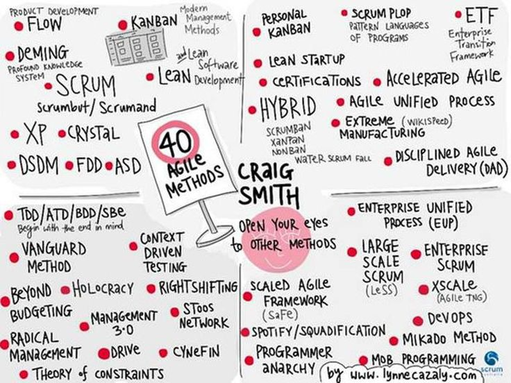

# Agile introduction

<|

## What is Agile?

Note:
- A set of values and principles that support an iterative and incremental approach.

|>

|>

<|

## Why Agile?

|>

<|

## Flavours

|>

|>

## Why SCRUM?