# Agile introduction

<|

## What is Agile?

Note:
- A set of values and principles that support an iterative and incremental approach.

|>

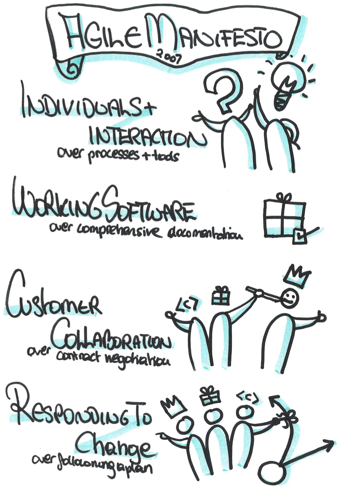

|>

<|

## Why Agile?

|>

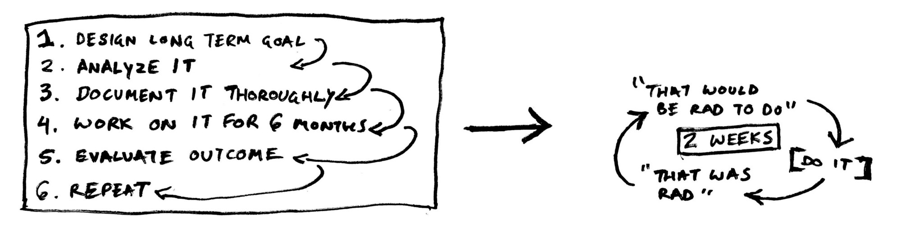

<|

## Flavours

|>

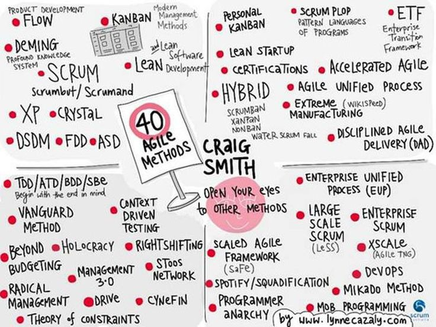

|>

## Why SCRUM?

<|

## SCRUM

<|

## SCRUM values

|>

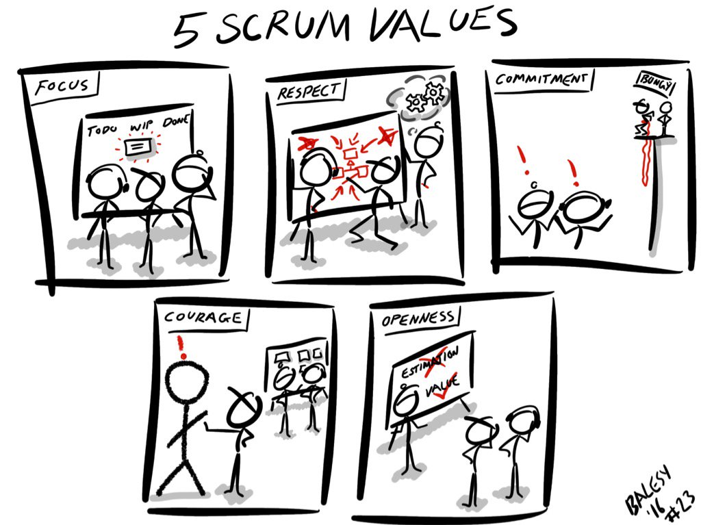

<|

## SCRUM flow

|>

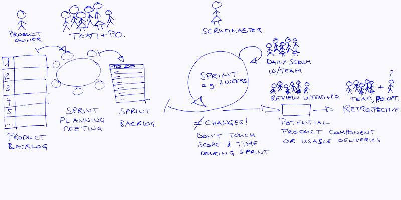

|>

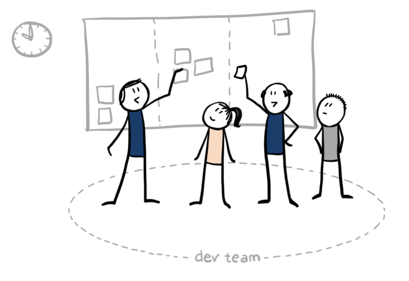

Note:
Daily standup
What did you do yesterday that’s worth mentioning ? 
What will you do today ?
What is blocking you?
Or
What did you do yesterday to help the team to reach the sprint goal?
What will you do today to help the team to reach the sprint goal?
What is stopping you from helping the team to reach the sprint goal?

|>

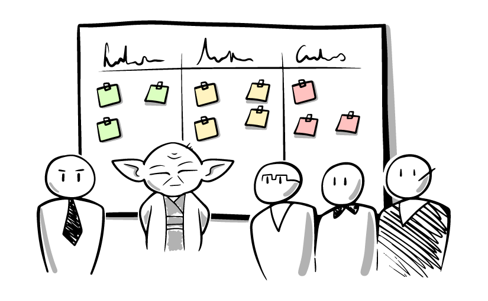

Note:
Retrospective

<|

## User stories

|>

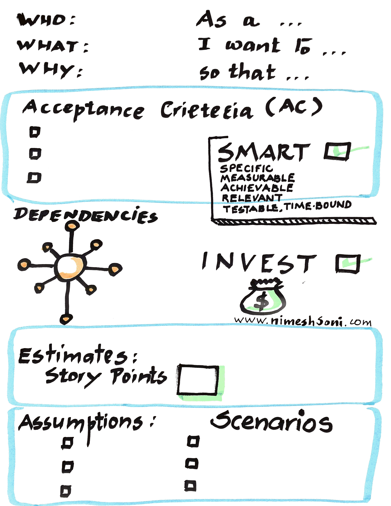

Note:
Invest doesn't mean should we do it, but does it apply to the following rules
- "I" ndependent (of all others)
- "N" egotiable (not a specific contract for features)
- "V" aluable (or vertical)
- "E" stimable (to a good approximation)
- "S" mall (so as to fit within an iteration)
- "T" estable (in principle, even if there isn't a test for it yet)

|>

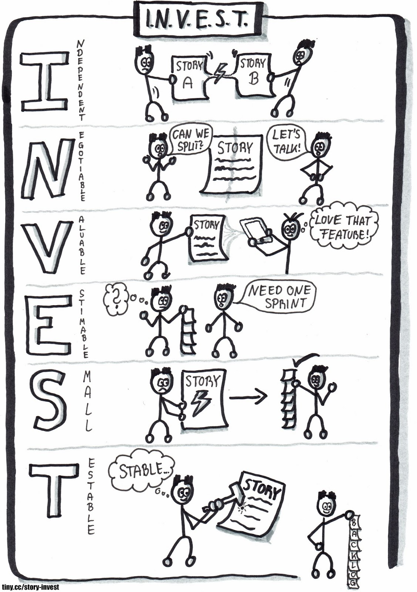

|>

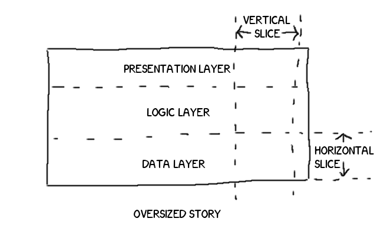

<|

## Estimation and planning

|>

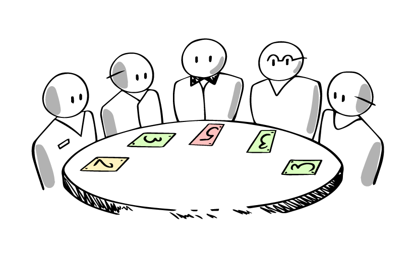

|>

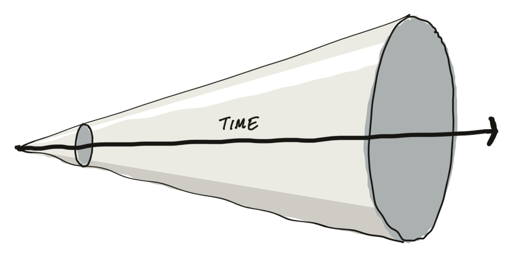

|>

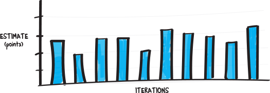

|>

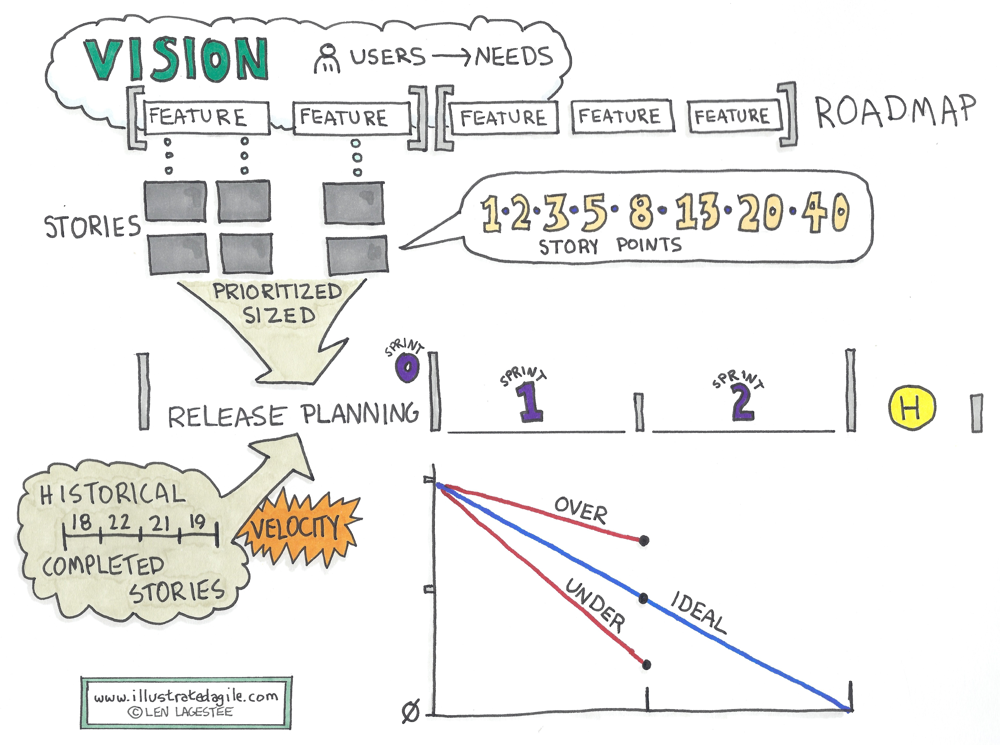

|>

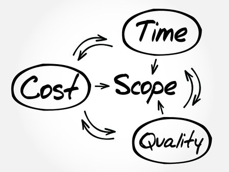

<|

## Information radiator

|>

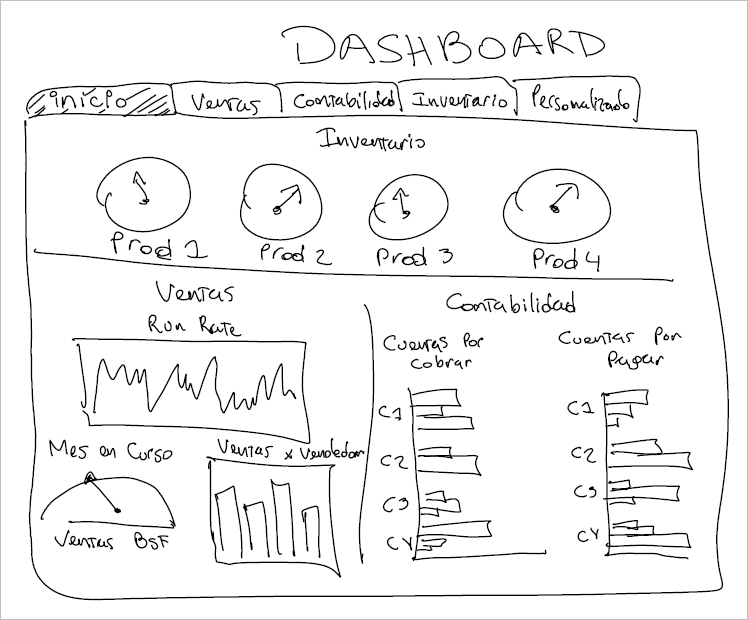

<|

## Keith's prime directive
“Regardless of what we discover, we understand and truly believe that
everyone did the best job they could, given what they knew at the time, their
skills and abilities, the resources available, and the situation at hand.”

<|

## Questions?

<|

## Feedback