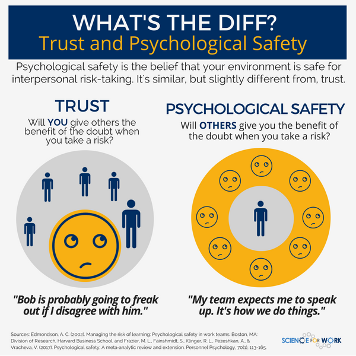

# Psychological safety

Note:
Psychological safety is a shared belief that the team is safe for interpersonal risk taking. 
It can be defined as "being able to show and employ one's self without fear of negative consequences of self-image, 
status or career.

|>

|>

## Take your stand

|>

## I understand the concept

|>

## When I make a mistake it is pinned on me

|>

## I am rejected for being different

|>

## I am able to bring up problems and tough issues

|>

## Risk taking is appreciated within Kunlabora

|>

## It is difficult to ask for help

|>

## I'm scared of proposing a new idea

|>

## New methodologies are met with curiosity

|>

## My unique skills and talents are valued and utilized

|>

## After an "Agile boomerang" I regret I suggested the idea

|>

## I believe everyone was honest during this exercise

